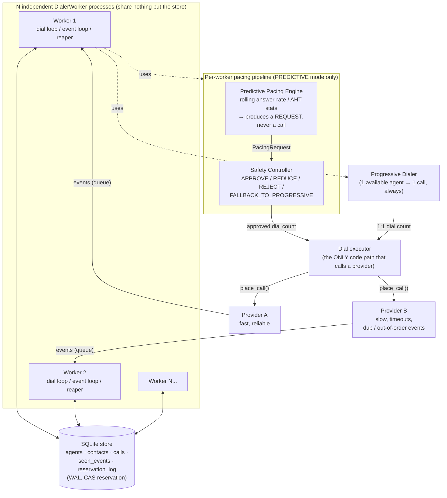
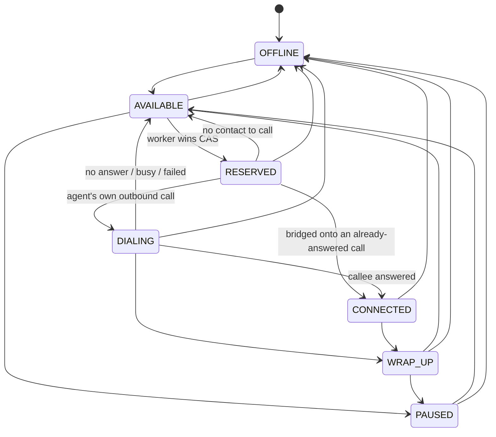
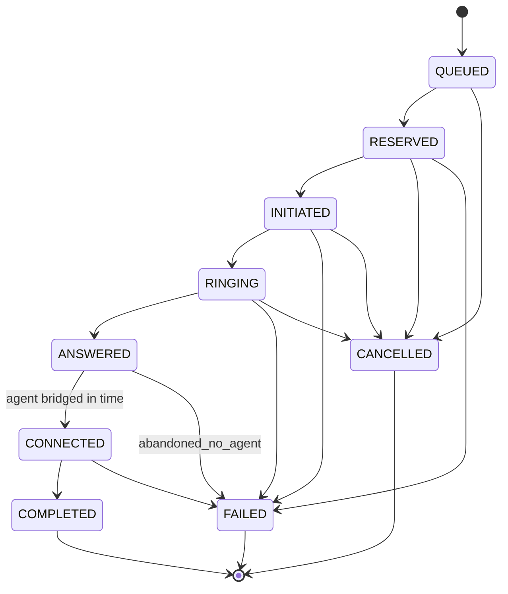

# SmartDialer — Architecture, ADR, and Scaling Notes

## 1. System architecture



**The one invariant that matters most**: neither the Predictive Pacing Engine
nor the Progressive Dialer ever hold a reference to a provider. The Safety
Controller's `approved_calls` count is the *only* number that ever reaches
the dial executor for predictive mode — architecturally identical in role to
the progressive dialer's own 1:1 executor. Predictive logic can be as
aggressive or as buggy as it likes; it cannot place a call.

## 2. Agent state machine



`RESERVED → CONNECTED` is the one transition that isn't obvious from the
name: it's what happens when a *speculative* predictive line (no agent
attached yet) gets answered and the dial loop bridges a freshly-available
agent straight onto it — there's no "agent's own ring phase" (DIALING) to
go through, because the callee is already on the line waiting.

Every transition is validated centrally by `AgentStateMachine.validate()`
and additionally CAS'd in SQL (`WHERE state=? AND version=?`), so an illegal
or stale transition simply fails closed rather than corrupting state.

## 3. Call state machine



### Reconciling out-of-order / duplicate provider events

Every call state carries a numeric rank (`QUEUED`=0 … `RINGING`=3 …
`COMPLETED`/`FAILED`/`CANCELLED`=6). `CallStateMachine.reconcile(current,
incoming)` decides what an arriving event actually does:

- **Terminal states are sticky and idempotent.** Once a call is
  `COMPLETED`/`FAILED`/`CANCELLED`, *any* further event — including a
  duplicate of the terminal event itself — is a no-op. This is enforced
  twice: once in `reconcile()` (the caller-side decision) and again inside
  `SQLiteStore.apply_call_transition()` (a data-layer check that a row
  already in a terminal state can never be written over). The second check
  exists because it closes a real race we hit during development: a slow
  in-flight "bridge an agent" attempt finishing *after* the reaper had
  already reaped the same call as a timeout would otherwise resurrect a
  dead call.
- **A terminal event always wins**, even if it arrives before a
  lower-ranked one (e.g. Provider B delivering `COMPLETED` before
  `ANSWERED` on a flaky connection). The call is marked accordingly and any
  later stray `ANSWERED` for it is dropped by the stickiness rule above.
- **A stale or duplicate non-terminal event** (rank ≤ current rank) is
  dropped.
- **Exact duplicates** (same `event_id`, e.g. a provider redelivering a
  webhook) are caught even earlier, by an `INSERT`-or-fail on a
  `seen_events(event_id)` table — this is what lets Provider B safely emit
  a byte-identical duplicate `RINGING` event without it ever reaching the
  reconciliation logic at all.

## 4. Concurrency: how double-reservation is actually prevented

Agent reservation is a single atomic statement:

```sql
UPDATE agents SET state='RESERVED', version=version+1, reserved_by=?, lease_expires_at=?
WHERE id=? AND state='AVAILABLE'
```

Only one caller's `UPDATE` can ever match a given row's `state='AVAILABLE'`
at a time — SQLite serializes writers itself (WAL journal + a `busy_timeout`
retry loop for transient `database is locked` errors), so there is no
Python-level lock anywhere in this path. `tests/test_store_concurrency.py`
proves this isn't just an assertion: it spawns 25 real OS threads, each with
its *own* SQLite connection, racing on a `threading.Barrier` to reserve the
exact same agent row, and asserts exactly one wins. Contact claiming is
proven the same way. This is the strongest correctness proof in the repo
precisely because it doesn't rely on Python's GIL or asyncio's cooperative
scheduling to "happen" to serialize things — it proves the guarantee holds
even under genuine OS-level parallelism, which is what actually matters once
these workers become separate processes or machines.

`scripts/load_test.py` demonstrates the same property under sustained,
realistic load: 8 async workers hammering a 40-agent pool report a ~28% CAS
win rate (i.e. ~72% of reservation attempts genuinely lose a real race to
another worker) and the script's final invariant check confirms no agent
was ever left double-booked.

### Idempotency, leases, and crash recovery

- Every `CallJob` carries a unique `idempotency_key`; `Provider.place_call()`
  returns the same `provider_call_ref` for a repeated key instead of
  starting a second outbound call, and `calls.idempotency_key` is a UNIQUE
  column so even a buggy retry can't insert a duplicate row.
- Every reservation (agent *and* call) carries a lease
  (`lease_expires_at`), renewed at each state transition. A background
  reaper (`DialerWorker._reaper_loop`) periodically reclaims agents/calls
  whose lease has expired — this is what recovers from a worker crashing
  mid-call: nothing about the recovery path cares *why* the lease expired
  (crash, provider hang, network partition), it just reclaims and moves on.
  `tests/test_worker_failure_handling.py` exercises this directly: it
  simulates a "crashed worker" (reserves an agent, moves it to `DIALING`,
  then simply stops running — no clean release) and shows a second,
  independent worker's reaper reclaims the agent once the lease expires,
  without ever double-booking it in the meantime.
- The call lease is a **liveness timeout, renewed on every transition**,
  not a fixed deadline sized to the whole call — otherwise a long
  `CONNECTED` conversation would get falsely reaped mid-call just because
  it outlived the window that was set back when it was first dialed. (We
  hit exactly this bug during development; see the commit history / the
  `renew_lease_seconds` parameter on `apply_call_transition`.)

## 5. Predictive pacing, in detail

`PredictivePacingEngine` keeps a rolling window (default 50 outcomes) of
recent `answered`/`talk_time` samples and produces a classic "lines per
agent" recommendation:

```
ratio           = 1 / clamp(answer_rate, 0.10, 0.95)      # capped by engine_max_line_ratio
target_lines    = active_agent_headcount * ratio
requested_calls = max(0, round(target_lines) - in_flight_lines)
```

`active_agent_headcount` (not just "agents free *this tick*") is
deliberately the denominator — predictive dialing's entire point is to
place calls *before* an agent frees up, so the target has to represent
total staffed capacity, not the current instant's idle count.
`in_flight_lines` deliberately includes `CONNECTED` calls, not just the
pre-answer states — a connected call spends the overwhelming majority of
its life in that state (minutes of talk time vs. seconds of ringing), so
excluding it would make the math think an agent mid-conversation is free
capacity and dial straight through it. (This was a real bug during
development, not a hypothetical one — it's the single biggest reason an
early version of this system produced 50-85% abandonment instead of
15-20%.)

This is a *request*, nothing more — `PredictivePacingEngine` has no
reference to a provider or a dial executor.

## 6. The Safety Controller, in detail

`SafetyController.evaluate(request, available_agents, in_flight)` is the
only function in the codebase allowed to hand a dial count to the code that
actually calls a provider for predictive mode. It layers several
independent checks, each a defense a real predictive dialer needs:

1. **Cold-start fallback.** Fewer than `min_samples_for_predictive` (20)
   outcomes observed → `FALLBACK_TO_PROGRESSIVE`. Don't trust statistics
   you don't have yet.
2. **Provider circuit breaker.** Recent provider error rate above 30% →
   `FALLBACK_TO_PROGRESSIVE`. A struggling provider is not a signal to
   dial *more* aggressively while it figures itself out.
3. **Adaptive abandonment feedback (persistent, not per-tick).** Every
   `ANSWERED` call reports whether an agent was actually ready
   (`record_answered_call`). When the rolling abandonment rate exceeds the
   target (3%), a `pacing_scale ∈ [0.1, 1.0]` ratchets *down*
   multiplicatively (×0.7) and only climbs back *up* slowly (×1.03) once
   abandonment is comfortably under target. This state persists across
   ticks deliberately — a single bad tick shouldn't fully self-correct, and
   a single good tick shouldn't erase the memory of a bad stretch.
   Crucially, `pacing_scale` scales the **speculative portion of the ratio
   itself** (`effective_ratio = 1 + (ratio - 1) * pacing_scale`), not just
   the current tick's incremental request — discounting only the
   incremental delta would merely slow how fast the system *ramps up* to
   the same steady-state number of concurrent speculative lines, never
   actually lower it, since once `in_flight` catches up to an unscaled
   target the delta hits zero on its own regardless of how bad
   abandonment is trending. (This was the second real bug found during
   development — an earlier version discounted the delta and the
   ratchet had no actual effect on steady-state abandonment.)
4. **Critical abandonment override.** Even at the pacing floor, a
   tight-capacity scenario (few agents, low answer rate, long AHT) can
   keep abandonment elevated indefinitely — the floor is a *floor*, not a
   safety guarantee. If the rolling abandonment rate exceeds a critical
   threshold (3x target) regardless of `pacing_scale`, the controller stops
   trusting the ratchet and cuts over to a full `FALLBACK_TO_PROGRESSIVE`
   (zero speculative lines) until it recovers. This is the literal
   "fall back to progressive behavior" the spec asks for, and it's the one
   that actually fires in the harder simulation scenarios below.
5. **Hard cap, always.** Regardless of everything above,
   `approved_calls ≤ round(available_agents * hard_max_line_ratio) −
   in_flight` (default ratio 2.0). This is deliberately independent of the
   adaptive logic — a bug in the ratchet, the pacing engine, or the answer
   rate estimate cannot push dialing past a fixed, simple, auditable
   multiple of headcount.

`SafetyDecision` is one of `APPROVE` / `REDUCE` / `REJECT` /
`FALLBACK_TO_PROGRESSIVE`, each carrying a human-readable reason string that
the worker logs — every pacing decision the system makes is explainable
after the fact from the log alone.

## 7. Mock providers

Both implement the same `Provider` interface (`place_call()` returns a
provider-side ref; events arrive on an `asyncio.Queue` the worker drains) —
the worker code has no branch anywhere that checks which provider it's
talking to.

| | Provider A | Provider B |
|---|---|---|
| Ring delay | 0.05–3s | 0.5–5s |
| Failure rate | ~4% | ~8% |
| Silent timeout (no terminal event, ever) | — | ~12% |
| Duplicate events (exact + semantic) | — | ~15% chance per event |
| Out-of-order terminal-before-answered | — | ~10% |

Provider B's silent-timeout mode is what actually exercises the reaper's
lease-expiry recovery path end-to-end (rather than just the direct
duplicate/reconciliation logic) — `tests/test_worker_failure_handling.py`
uses `timeout_rate=1.0` to make this deterministic.

## 8. ADR — key technology choices

**Python + asyncio, not Go/threads-per-worker.** The domain here is almost
entirely I/O-bound (DB round-trips, simulated network calls) with a heavy
statistics/simulation component, both of which Python handles well, and
asyncio's cooperative model made the "many workers, one process, shared
event loop" prototype fast to build and easy to reason about in tests
(deterministic interleaving via explicit `await` points). The real cost we
paid for this: cooperative scheduling is not preemptive, so a worker doing
a chunk of synchronous work (SQLite calls, which are blocking; a
`place_call()` that never truly awaits anything) can **starve** every other
worker's task until it hits an actual suspension point. We hit this for
real during development — one worker was grabbing 5-10x its fair share of
agents — and fixed it with explicit `await asyncio.sleep(0)` yield points
after each unit of work in the dial loop, rather than converting the whole
DB layer to a thread pool. A real distributed deployment sidesteps this
class of bug entirely by using actual separate OS processes (see §9) —
which is exactly why the concurrency *correctness* proof
(`test_store_concurrency.py`) is built on real threads/processes and not on
asyncio scheduling: asyncio fairness is a performance/liveness concern,
not a safety one, and the two must not be conflated.

**SQLite (WAL mode) as the shared store, not Redis/Postgres.** For a
prototype, SQLite gives durable, transactional, ACID storage with zero
external dependencies to install or run, while still being a *real* shared
database multiple independent processes can safely hit — the optimistic
concurrency control pattern here (`UPDATE ... WHERE state=? AND
version=?`, check `rowcount`) is exactly the same pattern you'd write
against Postgres or a distributed KV store with compare-and-set, so the
correctness logic transfers directly; only the storage engine changes.
`PRAGMA synchronous=NORMAL` (safe under WAL — a crash can lose at most the
last few commits, never corrupt the file) was a meaningful, necessary
tuning change: at the default `FULL` setting, per-operation fsync latency
under load was itself distorting the system's real-time responsiveness
enough to visibly worsen abandonment in the simulations below.

**A compressed but wall-clock-derived simulation clock, not a full virtual
scheduler.** `ScaledClock` derives virtual time from real elapsed time
(`virtual = real_elapsed * speed_factor`) rather than manually advancing a
counter. This is a deliberate simplicity trade-off: it lets a 30-minute
simulated campaign finish in ~20 real seconds using the exact same asyncio
event loop and `await clock.sleep(...)` call sites as production code,
with no discrete-event-simulation engine to build or validate — at the
cost of the system's *real* per-operation latency (DB commits, Python
overhead) bleeding into the simulated timeline exactly as described above.
A production deployment wouldn't compress time at all, so this cost is
specific to (and contained within) the simulation harness.

## 9. Bottlenecks and what changes from 100 → 10,000 agents

The empirical scaling data below is from this exact prototype (single
process, one SQLite file, `synchronous=NORMAL`), predictive mode, 50%
answer rate / 120s AHT, run to steady state:

| Agents | Abandonment | Utilization |
|---|---|---|
| 10 | ~15% | ~90% |
| 50 | ~37% | ~86% |

Utilization holds up fine at 50 agents — the fairness fix (§8) mostly
resolved that axis. Abandonment getting *worse* with more agents in a
single-process/single-store prototype, even though the *ratio* of
speculative lines to headcount is unchanged, is real evidence of where this
architecture starts to strain, and it previews exactly the bottlenecks that
matter at 100 → 10,000 scale:

1. **Single SQLite writer.** SQLite allows exactly one writer transaction
   at a time; every agent reservation, call transition, and lease renewal
   is a separate committed transaction. At 100 agents with a handful of
   workers this is invisible; at 10,000 agents with dozens of worker
   processes it becomes *the* bottleneck — write throughput, not CPU or
   network, caps how fast the whole system can react. **Fix:** move
   reservation/lease state to a database built for concurrent writers
   (Postgres with row-level locking, or a distributed KV store like Redis
   with per-agent `SETNX`/Lua-script CAS, or DynamoDB conditional writes)
   — the exact same `WHERE state=? AND version=?` CAS pattern translates
   directly; only the engine changes.
2. **Per-tick full-table agent scans.** `list_agents(state=AVAILABLE)`
   scans (with an index, still a scan of the *result set*) every tick, for
   every worker. At 10,000 agents split across many campaigns and many
   workers, this is a lot of redundant polling. **Fix:** partition/shard
   agents by campaign (already logically separate) and by worker
   assignment range, so each worker's queries touch a bounded slice; move
   from polling to a push model (a work queue / pub-sub notification when
   an agent becomes available) so workers aren't re-scanning on every
   `poll_interval` tick regardless of whether anything changed.
3. **In-process event queues.** Each `Provider` instance holds its events
   in an in-memory `asyncio.Queue` local to one worker process. A real
   telecom integration delivers events via webhooks to a public endpoint —
   at scale this needs a durable ingestion layer (a message queue: SQS,
   Kafka, or a Postgres-backed outbox) sitting between "provider webhook
   received" and "worker processes it," both so no event is lost if a
   worker is momentarily down and so ingestion scales independently of
   worker count.
4. **The predictive/safety feedback loop's statistical window.** A
   50-sample rolling window is appropriately sized for a single worker
   serving one campaign of ~10-50 agents; at 10,000 agents split across
   many workers, each worker only sees a fraction of the traffic, so its
   local window is *noisier*, not less noisy — the natural fix is a
   **shared, campaign-level** rolling statistic (e.g. in Redis, updated
   atomically) that all of a campaign's workers read from and contribute
   to, rather than each worker maintaining its own local, under-sampled
   view. This also directly addresses the observed abandonment-vs-scale
   regression: more agents *should* mean better statistical smoothing
   (larger sample, lower variance), and it will, once the sample is
   actually pooled across workers instead of fragmented per-worker.
5. **Worker fleet management.** At 100 agents, "start N worker processes"
   is an operational non-event. At 10,000 agents, workers need to be
   dynamically scaled with campaign size, health-checked, and have their
   crashed instances' leases reclaimed promptly (the reaper already
   handles the *correctness* of this; at scale it also needs to run
   frequently enough, and be itself horizontally scaled/sharded, that
   reclaim latency doesn't become a new source of idle capacity).

None of this requires a different *correctness* model — CAS reservation,
lease-based crash recovery, sticky terminal states, and the layered Safety
Controller all translate unchanged to a distributed deployment. What
changes is exclusively the infrastructure each of those mechanisms is built
on.

## 10. Final question

> How would you build a SmartDialer that gets as much of the utilization
> benefit of predictive dialing as possible, while retaining the
> deterministic safety characteristics of progressive dialing?

Treat predictive pacing as **purely advisory input to an admission-control
layer that is otherwise identical in role to the progressive dialer's own
executor** — never as a second, parallel path to the telecom provider. That
one structural decision is what makes the rest of the safety story
possible: because the pacing engine can only ever *request* calls, not
place them, it can be as statistically aggressive, as buggy, or as
miscalibrated as it likes and the worst it can do is get its request
reduced, rejected, or ignored. The system in this repo implements that as:

- A **single dial executor** downstream of both the progressive dialer and
  the Safety Controller — there is exactly one code path in the entire
  codebase that calls `provider.place_call()`, and neither the pacing
  engine nor any predictive logic has a handle on it.
- A **graceful degradation ladder**, cheapest-to-safest:
  `predictive at full pacing → predictive at a ratchet-reduced pacing
  scale → full progressive fallback (zero speculative lines) → (in a real
  deployment) pause dialing entirely on provider outage`. The controller
  moves down this ladder automatically and reversibly, based on
  ground-truth feedback, not on trusting its own model.
- A **feedback loop on what actually happened**, not what was predicted —
  the controller reduces pacing because agents were genuinely left
  waiting on an answered call (`record_answered_call`) or the provider is
  genuinely erroring (`record_provider_outcome`), never because the model
  *thinks* it might be wrong. This is the same principle a rate limiter or
  circuit breaker uses: react to observed outcomes, not to the thing you're
  trying to protect against.
- **A hard, static cap that doesn't depend on any of the above working
  correctly.** `hard_max_line_ratio` is a fixed multiple of headcount,
  checked on every single decision regardless of what the adaptive logic
  concluded. If the ratchet has a bug, the statistics are garbage, or the
  answer-rate estimate is wildly wrong, this is the backstop that still
  holds — the equivalent of a progressive dialer's inherent 1:1 ceiling,
  just parameterized instead of hardcoded to exactly 1.0.
- **Cold-start and low-confidence fallback to progressive**, so the system
  is only ever as aggressive as its actual sample size justifies — a
  brand-new campaign, or one whose stats window was just reset (an agent
  surge, a provider swap), runs safely at progressive parity until it has
  earned the right to do otherwise.

The utilization *benefit* comes entirely from how much the pacing engine
and the ratchet are allowed to explore above 1:1 before the safety layers
intervene — that's a tuning question (target abandonment rate, ratchet
speed, window size), and it's explicitly *not* where the safety guarantee
lives. The guarantee lives in the fact that the admission-control layer is
structurally incapable of being bypassed, and every one of its checks
(hard cap, circuit breaker, critical-abandonment override) is independent
of whether the adaptive/statistical parts are working correctly at all.
